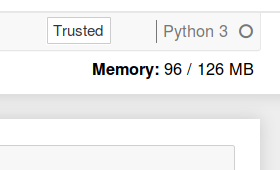

.. _howto/admin/nbresuse:

=======================
Check your memory usage
=======================

The `jupyter-resource-usage <https://github.com/jupyter-server/jupyter-resource-usage>`_ extension is part of
the default installation, and tells you how much memory your user is using
right now, and what the memory limit for your user is. It is shown in the
top right corner of the notebook interface. Note that this is memory usage
for everything your user is running through the Jupyter notebook interface,
not just the specific notebook it is shown on.

