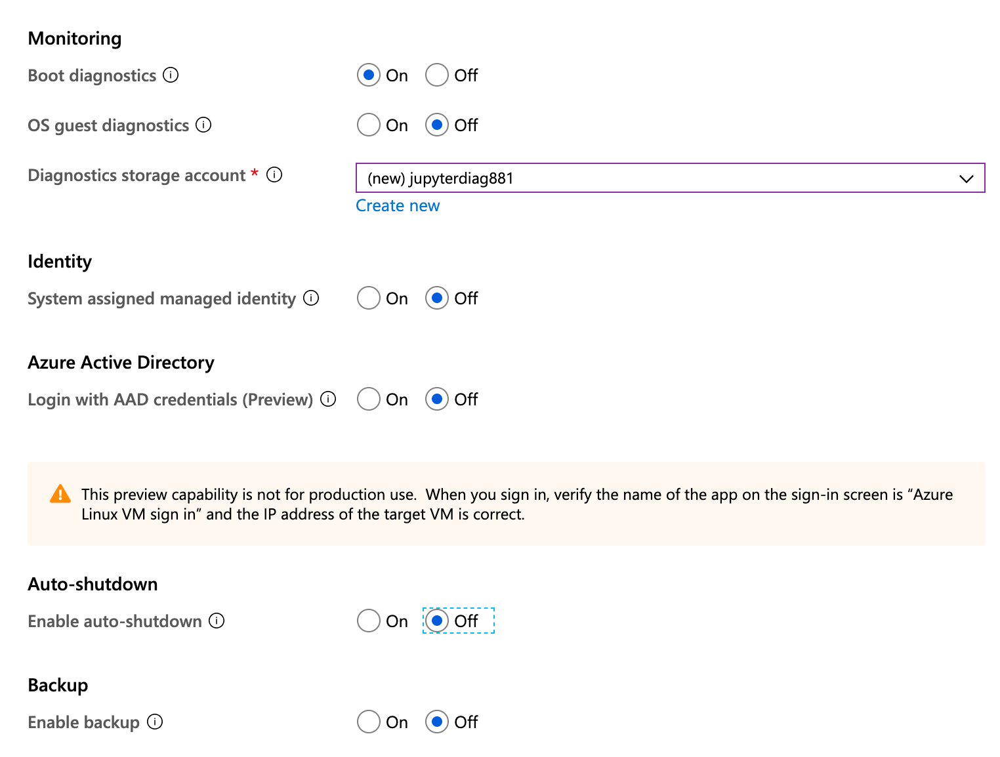
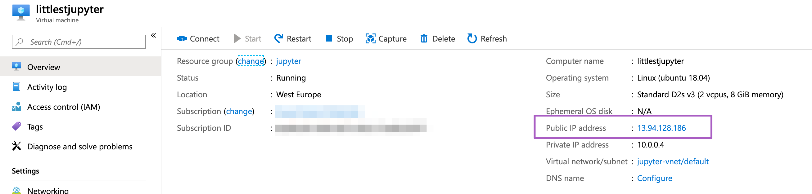
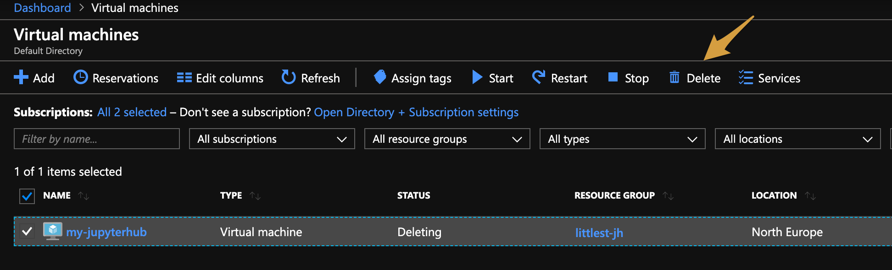

====================
Installing on Azure
====================

Goal
====

By the end of this tutorial, you should have a JupyterHub with some admin
users and a user environment with packages you want to be installed running on
`Microsoft Azure <https://azure.microsoft.com>`_.

Prerequisites
==============

* A Microsoft Azure account. 

* To get started you can get a free account which  includes 150 dollars worth of Azure credits (`get a free account here <https://azure.microsoft.com/en-us/free//?wt.mc_id=LTJH-github-taallard>`_) 

These instructions cover how to set up a Virtual Machine
on Microsoft Azure. For subsequent information about creating
your JupyterHub and configuring it, see `The Littlest JupyterHub guide <https://the-littlest-jupyterhub.readthedocs.io/en/latest/>`_.

Choose your Virtual Machine operating system
=============================================

#. Go to `your Azure portal <https://portal.azure.com/>`_ 
#. Find virtual machines on your Azure dashboard (left-hand panel)

    .. image:: ../images/providers/azure/azure-vms.png
            :alt: Virtual machines on Azure portal

#. Click "+ add" to create a new Virtual Machine

    .. image:: ../images/providers/azure/add-vm.png
        :alt: Add a new virtual machine

#. Select Create VM from Marketplace
    .. image:: ../images/providers/azure/create-vm.png
        :alt: Create from the marketplace

* **Choose an Ubuntu server for your VM**.
    * Click `Ubuntu Server`
    * Click `Ubuntu Server 18.04 LTS`
    * Make sure `Resource Manager` is selected when creating the virtual machine

    .. image:: ../images/providers/azure/ubuntu-vm.png
        :alt: Ubuntu VM

Customize the virtual machine
==============================

* Basics
    * **Name**. Use a descriptive, short name that you like (note that you cannot use spaces or special characters)
    * **VM disk type**. Choose SSD
    * **Username**. Choose any username. This will be used to SSH into your VM, it is the root username for your VM.
    * **Authentication type**. Change authentication type to "password"
    * **Password**. Type in a password. This will be used to SSH into the machine. It is your user password on the VM.
    * **Login with Azure Active Directory**. Choose "Disabled" (usually the default)
    * **Subscription**. Choose the "Free Trial" if this is what you're using. Otherwise, choose a different plan. This is the billing account that will be charged.
    * **Resource group**. Create a new resource group if you don't already have one. Resource groups let you bundle components that you request from Azure. This is overkill for our use case so it's easiest to create a new resource group.
    * **Location**. Choose a location near where you expect your users to be located.

    .. image:: ../images/providers/azure/password-vm.png
            :alt: Add password to VM

* Size
    * Choose a machine with enough RAM to accommodate your users. For example, if each user needs 2GB of RAM, and you have 10 total users, you need at least 20GB of RAM on the machine. It's also good to have a few GB of "buffer" RAM beyond what you think you'll need.
    * Click on "select image" and choose one of the options, then click "select".
    
    .. image:: ../images/providers/azure/size-vm.png
            :alt: Choose vm size 
    
* Settings
    * Availability options
        * Select no infrastructure redundancy required
    * Storage
        * **Use managed disks**. Choose "yes"
        * **OS disk size**. Click on create and attach a new disk. Select an appropriate type and size and click ok.

    .. image:: ../images/providers/azure/disk-vm.png
            :alt: Choose disk size  

    * Network
        * **Virtual network**. Do not change this.
        * **Subnet**. Do not change this.
        * **Public IP address**. Do not change this.
        * **Network Security Group**. Choose "Basic"
        * **Select public inbound ports**. Check "HTTP", "HTTPS", and "SSH".
    * Extensions
        * **Extensions**. Should read "No extensions".
    * Auto-Shutdown
        * **Enable auto-shutdown**. Choose "Off".
    * Monitoring
        * **Boot diagnostics**. Choose "On".
        * **OS guest diagnostics**. Choose "Disabled".
        * **Diagnostics storage account**. Leave as the default.
    * Managed service identity
        * **System assigned managed identity**. Choose "No".
    * Backup
        * **Backup**. Choose "Disabled".

* Summary -> confirm -> OK

* Confirm that it worked
    * Wait for it to be created. This might take about 5-10 minutes.
    * After completion, you should see a similar screen to the one below:

    .. image:: ../images/providers/azure/deployed-vm.png
        :alt: Deployed VM

SSH into your virtual machine
------------------------------

* Click on go to resource (see image above)

* Copy the **Public IP address**

* Open a terminal on your local machine.
* SSH into your VM: ::

    ssh <username>@<ip-address>

where the username is the one you chose in the Settings step.

Install JupyterHub
===================

* Follow the guide at `https://the-littlest-jupyterhub.readthedocs.io/en/latest/install/custom.html#install-custom <https://the-littlest-jupyterhub.readthedocs.io/en/latest/install/custom.html#install-custom>`_ 

(optional) Delete your virtual machine
=======================================

* Go to "Virtual Machines"
* Click on your machine name
* Click on "Stop" to stop the machine temporarily, or "Delete" to delete it permanently.

