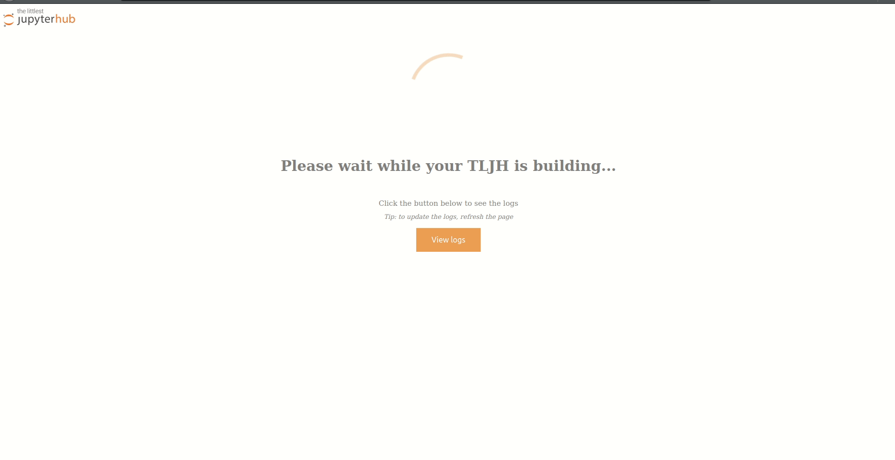

.. _topic/customizing-installer:

=========================
Customizing the Installer
=========================

The installer can be customized with commandline parameters. The default installer
is executed as:

.. code-block:: bash

    curl -L https://tljh.jupyter.org/bootstrap.py \
     | sudo python3 - \
       <parameters>

This page documents the various options you can pass as commandline parameters to the installer.

.. _topic/customizing-installer/admin:

Serving a temporary "TLJH is building" page
===========================================
``--show-progress-page`` serves a temporary "TLJH is building" progress page while TLJH is building.

* The page will be accessible at ``http://<tljh-public-ip>/index.html`` in your browser.
  When TLJH installation is complete, the progress page page will stop and you will be able
  to access TLJH as usually at ``http://<tljh-public-ip>``.
* From the progress page, you will also be able to access the installation logs, by clicking the
  **Logs** button or by going directly to ``http://<tljh-public-ip>/logs`` in your browser.
  To update the logs, refresh the page.

.. note::

  The ``http://<tljh-public-ip>/index.html`` page refreshes itself automatically every 30s.
  When JupyterHub starts, a JupyterHub 404 HTTP error message (*Jupyter has lots of moons, but this is not one...*)
  will be shown instead of the progress page. This means JupyterHub was started succesfully and you can access it
  either by clicking the `Control Panel` button or by going to ``http://<tljh-public-ip>/`` directly.

For example, to enable the progress page and add the first *admin* user, you would run:

.. code-block:: bash

  curl -L https://tljh.jupyter.org/bootstrap.py \
  | sudo python3 - \
   --admin admin --showprogress-page

Adding admin users
===================

``--admin <username>:<password>`` adds user ``<username>`` to JupyterHub as an admin user
and sets its password to be ``<password>``.
Although it is not recommended, it is possible to only set the admin username at this point
and set the admin password after the installation.

Also, the ``--admin`` flag can be repeated multiple times. For example, to add ``admin-user1``
and ``admin-user2`` as admins when installing, depending if you would like to set their passwords
during install you would:

* set ``admin-user1`` with password ``password-user1`` and ``admin-user2`` with ``password-user2`` using:

.. code-block:: bash

    curl -L https://tljh.jupyter.org/bootstrap.py \
     | sudo python3 - \
       --admin admin-user1:password-user1 --admin admin-user2:password-user2

* set ``admin-user1`` and ``admin-user2`` to be admins, without any passwords at this stage, using:

.. code-block:: bash

    curl -L https://tljh.jupyter.org/bootstrap.py \
     | sudo python3 - \
       --admin admin-user1 --admin admin-user2

* set ``admin-user1`` with password ``password-user1`` and ``admin-user2`` with no password at this stage using:

.. code-block:: bash

    curl -L https://tljh.jupyter.org/bootstrap.py \
     | sudo python3 - \
       --admin admin-user1:password-user1 --admin admin-user2

Installing python packages in the user environment
==================================================

``--user-requirements-txt-url <url-to-requirements.txt>`` installs packages specified
in the ``requirements.txt`` located at the given URL into the user environment at install
time. This is very useful when you want to set up a hub with a particular user environment
in one go.

For example, to install the latest requirements to run UC Berkeley's data8 course
in your new hub, you would run:

.. code-block:: bash

    curl -L https://tljh.jupyter.org/bootstrap.py \
     | sudo python3 - \
       --user-requirements-txt-url https://raw.githubusercontent.com/data-8/materials-sp18/HEAD/requirements.txt

The URL **must** point to a working requirements.txt. If there are any errors, the installation
will fail.

.. note::

   When pointing to a file on GitHub, make sure to use the 'Raw' version. It should point to
   ``raw.githubusercontent.com``, not ``github.com``.

Installing TLJH plugins
=======================

The Littlest JupyterHub can install additional *plugins* that provide additional
features. They are most commonly used to install a particular *stack* - such as
the `PANGEO Stack <https://github.com/yuvipanda/tljh-pangeo>`_ for earth sciences
research, a stack for a particular class, etc.

``--plugin <plugin-to-install>`` installs and activates a plugin. You can pass it
however many times you want. Since plugins are distributed as python packages,
``<plugin-to-install>`` can be anything that can be passed to ``pip install`` -
``plugin-name-on-pypi==<version>`` and ``git+https://github.com/user/repo@tag``
are the most popular ones. Specifying a version or tag is highly recommended.

For example, to install the PANGEO Plugin version 0.1 in your new TLJH install,
you would use:

.. code-block:: bash

   curl -L https://tljh.jupyter.org/bootstrap.py \
    | sudo python3 - \
      --plugin git+https://github.com/yuvipanda/tljh-pangeo@v0.1

Multiple plugins can be installed at once with: ``--plugin <first-plugin-to-install> <second-plugin-to-install>``.

See :ref:`contributing/plugins` for more information about plugins.

.. note::

   Plugins are extremely powerful and can do a large number of arbitrary things.
   Only install plugins you trust.
